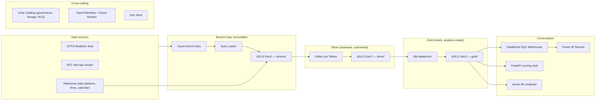

# transit-lakehouse-azure

Production Azure Databricks lakehouse for transit ridership analytics — Delta Lake medallion architecture, dbt-managed gold marts, Power BI Service consumer, fully Terraform-provisioned, observable, and CI/CD-driven.

[](https://github.com/ArashM0z/transit-lakehouse-azure/actions/workflows/ci.yml)
[](https://github.com/ArashM0z/transit-lakehouse-azure/actions/workflows/terraform.yml)
[](https://github.com/ArashM0z/transit-lakehouse-azure/actions/workflows/security.yml)
[](LICENSE)

## What this is

An end-to-end production lakehouse for transit ridership data on Microsoft Azure. Two public North American transit datasets are wired in out of the box:

- **MTA New York** — Subway Hourly Ridership, Bus Hourly Ridership, OMNY origin-destination, GTFS schedule (`data.ny.gov`).
- **Calgary Transit** — CTrain and Bus GTFS schedule and GTFS-Realtime feeds, open-data ridership snapshots (`data.calgary.ca`).

The data model and pipelines are generic — drop any GTFS-compliant feed in and the lakehouse will land it in bronze, conform it through silver, and produce the gold marts. The repo mirrors the production stack a public-transit analytics team would actually run:

- **Azure Data Lake Storage Gen2** with hierarchical namespace, lifecycle policies, and immutability locks on the bronze zone.
- **Azure Databricks** workspace with **Unity Catalog**, **Delta Lake**, **Auto Loader**, **Delta Live Tables**, and **Databricks Workflows**.
- **dbt-databricks** for gold-mart transformations with tests, documentation, and lineage.
- **Power BI Service** consuming the gold layer via DirectQuery, with star-schema semantic models, RLS, and deployment pipelines.
- **Azure Event Hubs** for streaming ingestion of GTFS-Realtime and synthetic AFC tap feeds.
- **Terraform** for the entire Azure footprint (workspace, storage, networking, Key Vault, identity, monitoring).
- **GitHub Actions** for CI/CD with terraform plan-on-PR, dbt build/test, Databricks Asset Bundles deploy, and Power BI deployment pipeline advance.
- **OpenTelemetry → Azure Monitor → Grafana** observability stack with SLOs and an alert runbook.
- **Docker Compose** local dev stack so the entire system can be run on a laptop.

## System architecture



Full C4 system, container, and component diagrams in [docs/architecture.md](docs/architecture.md).

## Quickstart — local development (10 minutes)

You can run the full pipeline on a laptop without any Azure cost. The local stack uses MinIO as an ADLS stand-in, Redpanda as Event Hubs, and Spark-on-Postgres for Delta Lake.

```bash
# 1. clone
git clone https://github.com/ArashM0z/transit-lakehouse-azure.git
cd transit-lakehouse-azure

# 2. bring up the local stack (postgres, minio, redpanda, spark, mlflow, grafana, prometheus, otel)
make up

# 3. seed reference data and generate a synthetic AFC tap stream
make seed
make stream  # in a separate terminal

# 4. run the bronze ingestion
make ingest-bronze

# 5. build silver + gold
make dbt-build

# 6. open dbt docs, Grafana, MinIO console
make docs       # http://localhost:8080
                # Grafana:  http://localhost:3000  (admin/admin)
                # MinIO:    http://localhost:9001  (minioadmin/minioadmin)
                # MLflow:   http://localhost:5000

# 7. tear down when done
make down
```

## Quickstart — deploy to Azure

You need: an Azure subscription, Azure CLI authenticated (`az login`), and Terraform 1.7+.

```bash
# 1. provision a dev environment
cd terraform/environments/dev
terraform init -backend-config="key=transit-lakehouse-dev.tfstate"
terraform plan -out plan.tfplan
terraform apply plan.tfplan

# 2. deploy Databricks Asset Bundle (notebooks, jobs, DLT pipelines)
cd ../../../databricks
databricks bundle validate
databricks bundle deploy --target dev

# 3. trigger the bronze ingestion job
databricks bundle run bronze_ingest --target dev

# 4. publish the Power BI report
cd ../powerbi
make publish ENV=dev
```

Detailed runbook in [docs/runbook.md](docs/runbook.md).

## Repository layout

```
.
├── .github/                # CI/CD workflows, issue & PR templates, CODEOWNERS
├── docs/                   # Architecture, runbook, ADRs, data contracts, perf
├── terraform/              # IaC: modules (databricks, storage, networking, monitoring), envs
├── src/                    # Python: ingestion, common utilities, FastAPI scoring stub
├── notebooks/              # Databricks notebooks (bronze, silver, gold)
├── dbt/                    # dbt project: bronze passthroughs, silver, gold marts, tests
├── helm/                   # Helm chart for AKS-deployed services
├── powerbi/                # Power BI semantic models, reports, deployment automation
├── tests/                  # unit / integration / data quality
├── scripts/                # synthetic data generators, deploy helpers
├── docker-compose.yml      # local development stack
├── Dockerfile              # multi-stage, non-root, distroless final
├── Makefile                # one-liner dev workflows
├── pyproject.toml          # ruff, mypy, pytest config; uv-managed
└── README.md
```

## Data model — gold marts

| Mart | Grain | Use case |
|------|-------|----------|
| `fact_ridership_hourly` | station × hour | Hourly ridership across the network |
| `fact_fare_revenue` | station × hour × fare_class | Revenue forecasting |
| `mart_event_demand_uplift` | event × station × hour | Event-day uplift attribution |
| `mart_station_kpis` | station × day | Operational KPIs (consumed by Power BI) |
| `mart_line_performance` | line × day | Line-level on-time, ridership, revenue |

Full data dictionary auto-generated to [docs/data_dictionary.md](docs/data_dictionary.md) on every `dbt docs generate`.

## Power BI

The Power BI Service workspace consumes the gold layer via DirectQuery against a Databricks SQL Warehouse. Three reports:

- **Network overview** — system-wide ridership and revenue KPIs.
- **Event demand uplift** — baseline vs event-day comparison with map overlays.
- **Fare revenue forecast** — forward forecasts with prediction intervals and what-if sliders.

Semantic-model documentation, DAX measure dictionary, RLS model, and performance-tuning artefacts in [powerbi/docs/](powerbi/docs/).

## Observability and SLOs

| Signal | SLO | Backing alert |
|--------|-----|---------------|
| Bronze freshness | < 5 min p95 | `bronze_freshness_breach` |
| Silver freshness | < 15 min p95 | `silver_freshness_breach` |
| Gold freshness | < 1 h p95 | `gold_freshness_breach` |
| Power BI report load | < 3 s p95 | `pbi_perf_breach` |
| Databricks SQL warehouse query | < 2 s p95 | `sql_warehouse_perf_breach` |
| Pipeline cost per run | < $4 daily | `cost_anomaly` |

Alert runbook entries in [docs/runbook.md](docs/runbook.md) — one section per alert: symptom → check → mitigation → rollback.

## Security and governance

- All secrets in **Azure Key Vault** via managed identity; zero secrets in code or CI.
- **Unity Catalog** privileges on every table, dynamic views for PII masking, lineage captured.
- **gitleaks** in pre-commit and CI to block leaks at PR time.
- **Trivy** filesystem and container scans; **Cosign**-signed images with **SLSA** provenance attestations.
- **Data contracts** (`docs/data_contracts/*.yaml`) at every zone boundary; CI fails on contract breach.
- Threat model and security posture in [SECURITY.md](SECURITY.md).

## Contributing

See [CONTRIBUTING.md](CONTRIBUTING.md). All commits use [Conventional Commits](https://www.conventionalcommits.org/) (enforced via pre-commit) and must be signed.

## License

MIT — see [LICENSE](LICENSE).

## Acknowledgements

Built as a portfolio project demonstrating the production-grade lakehouse pattern used at Crown transit agencies. Modeled after publicly documented stacks at Metrolinx, Transport for NSW, and the New York MTA. Synthetic data only — no production transit data is included.
 <!-- Badge status reflects the most recent push to main. -->

<!-- maintainer: armozhdehi -->

<!-- readme touched 2026-04-23 -->

<!-- readme touched 2026-05-05 -->

<!-- readme touched 2026-05-11 -->

<!-- final badges row touched 2026-05-13 -->
