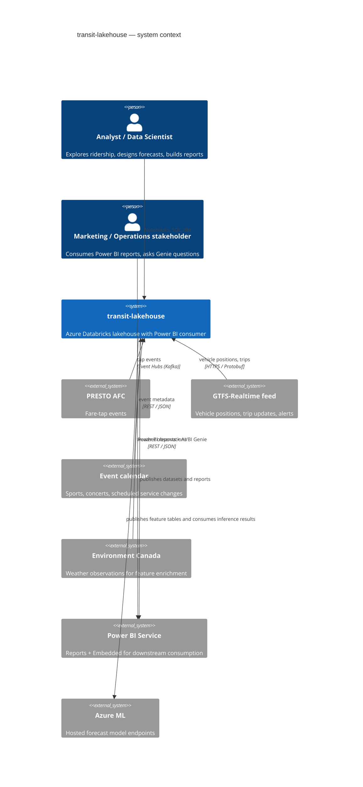
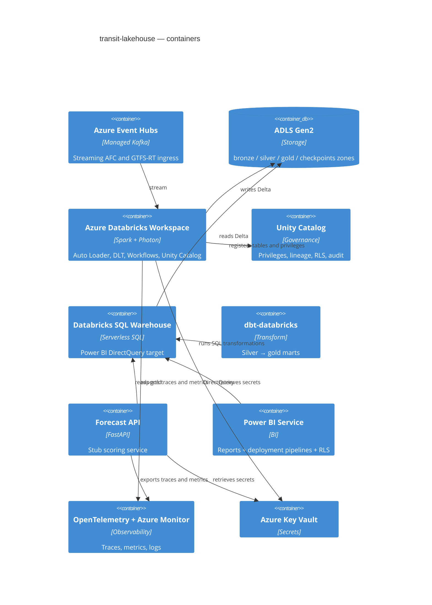
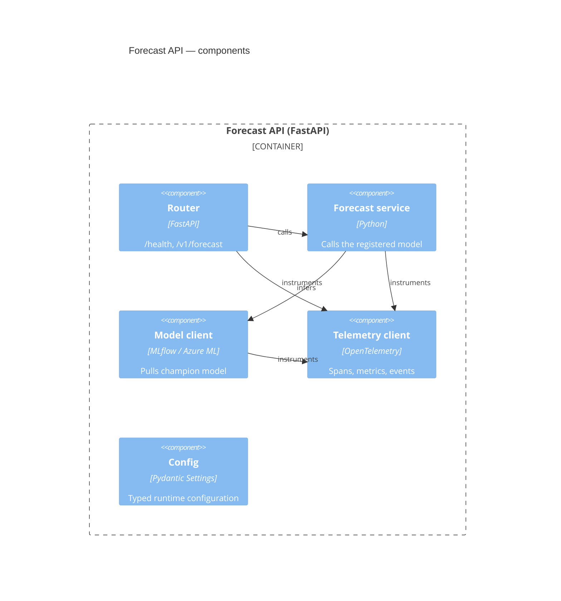
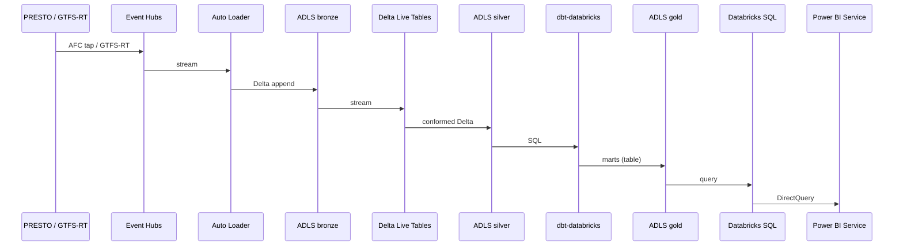

# Architecture

This document captures the system at three levels of detail using the
[C4 model](https://c4model.com/): **system context**, **container**, and
**component**.

## 1. System context

## 2. Containers

## 3. Components (FastAPI scoring service)

## 4. Data flow

## 5. Cross-cutting concerns

| Concern | How it's addressed |
|---------|--------------------|
| Identity | Workload Identity / Managed Identity for compute; Azure AD groups for analyst access |
| Secrets | Azure Key Vault + Databricks secret scopes |
| Encryption at rest | ADLS Gen2 SSE with customer-managed keys |
| Encryption in transit | TLS 1.3; mTLS between in-cluster services |
| Lineage | Unity Catalog + dbt-generated graph in `dbt docs` |
| Audit | Unity Catalog audit + Azure Monitor diagnostic settings |
| RLS | Dynamic view masking on PII columns; row-level filters bound to `current_user()` |
| SLOs | Bronze < 5 min, Silver < 15 min, Gold < 1 h; Power BI < 3 s query p95 |

## 6. Architectural decisions

ADRs live in [`docs/adr/`](adr/) using a lightweight Markdown template. Open a
PR adding `0NNN-short-title.md` for any new decision.
