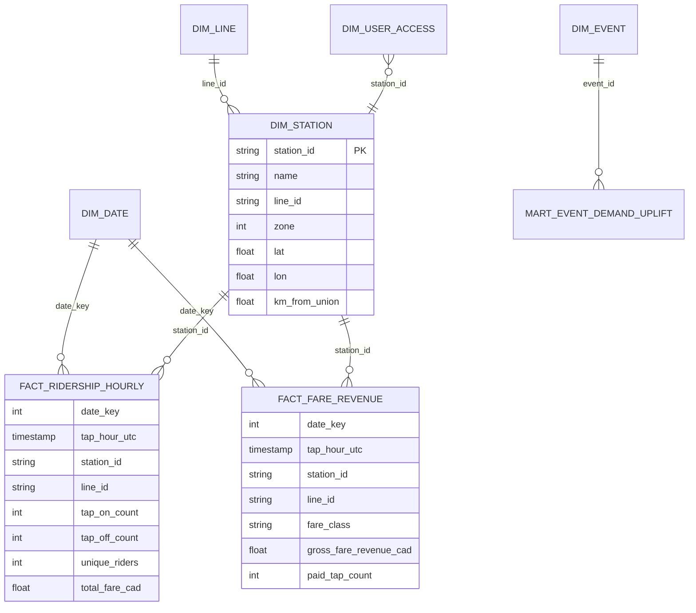

# Power BI semantic model

## Star schema

## Storage modes

| Table | Mode | Why |
|-------|------|-----|
| `fact_ridership_hourly` | DirectQuery (with aggregations) | Volume — last 30 days imported into agg table |
| `fact_fare_revenue` | DirectQuery (with aggregations) | Volume |
| `mart_event_demand_uplift` | Import | Small mart; needs fast slicer response |
| `dim_station`, `dim_line`, `dim_date` | Import | Small dimensions |
| `dim_user_access` | Import (refresh hourly) | RLS source |

## DAX measure dictionary

| Measure | Formula | Notes |
|---------|---------|-------|
| `Ridership` | `SUM(fact_ridership_hourly[unique_riders])` | Default fact-table measure |
| `Ridership MTD` | `CALCULATE([Ridership], DATESMTD('dim_date'[calendar_date]))` | Time intelligence |
| `Ridership YoY %` | `DIVIDE([Ridership] - [Ridership PY], [Ridership PY])` | Calculation group |
| `Fare Revenue` | `SUM(fact_fare_revenue[gross_fare_revenue_cad])` | |
| `Fare Revenue per Rider` | `DIVIDE([Fare Revenue], [Ridership])` | Avoid /0 with DIVIDE |
| `Event Day Uplift %` | `AVERAGEX(mart_event_demand_uplift, [uplift_multiplier]) * 100` | Used on event-uplift page |
| `Forecast vs Actual Variance %` | `DIVIDE([Ridership] - [Forecast Ridership], [Forecast Ridership])` | Backtest dashboard |

## Calculation groups

- **Time Intelligence**: Current, MTD, QTD, YTD, vs Prior Year, vs Prior Period, % Change YoY, % Change vs Prior Period.
- **Forecast Comparison**: Actual, Forecast, Lower PI, Upper PI, Variance, Variance %.

## Field parameters

- **Date Granularity**: hour, day, week, month, quarter.
- **Network Slice**: line, zone, station, fare class.
- **Measure Picker**: Ridership, Fare Revenue, Average Fare, Uplift %.

## Performance notes

See [perf.md](perf.md) for VertiPaq Analyzer screenshots and DAX Studio query-plan
artefacts before/after tuning.
